<!-- The Plate System · a poster series in six plates · type: Instrument Serif / Geist Mono / Inter · field: 9px cells, hard bands -->

<samp><a href="https://erys.app">ERYS.APP</a>&ensp;·&ensp;<a href="https://useknow.io">USEKNOW.IO</a></samp>

<samp><a href="https://thesora.io">THESORA.IO</a></samp>

<samp><a href="https://www.linkedin.com/in/udsy/">LINKEDIN</a>&ensp;·&ensp;<a href="https://instagram.com/udsyx">INSTAGRAM</a>&ensp;·&ensp;<a href="mailto:udayatejas2004@gmail.com">EMAIL</a></samp>

